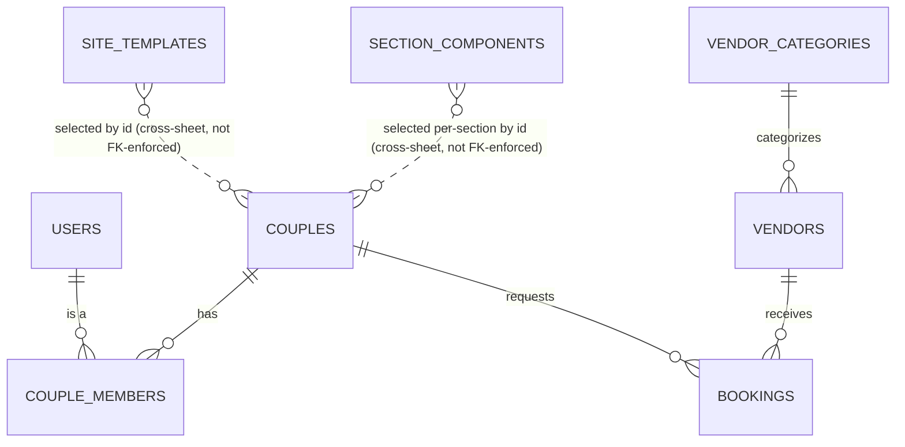
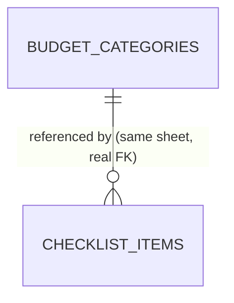

# Backend Table Design

Read [overview.md](../overview.md) first for the two constraints this design works
within: (1) `longcelot-sheet-db` isolates each actor in **their own physical Google
Sheet** — the admin sheet is the only shared/neutral ground, and `ref()` foreign-key
validation only works **within one spreadsheet**, never across two actors' sheets; (2)
template content is never stored as row data — only a `template_id` and the couple's
own content are.

Every table below states which physical sheet it lives in. "Admin sheet" tables are
registered with `actor: 'admin'` in `apps/api/schemas/admin/*.ts` (existing
convention). "Couple sheet" / "Vendor sheet" tables are registered with
`actor: 'couple'` / `actor: 'vendor'` — these run once per couple/vendor's own sheet,
so there is no `tenant_id` column needed inside them: the whole sheet **is** the
tenant boundary.

Fields already declared by `defineTable`'s `timestamps: true` (`_created_at`,
`_updated_at`) and `softDelete` (`_deleted_at`) are omitted from the tables below
unless a table deliberately opts out — assume `timestamps: true` on everything.

---

## Admin sheet

### `users` (exists, revise)

Login identity — one row per person who can sign in, not one row per couple/vendor
account. Already implemented; carrying forward with one addition below.

| Column | Type | Notes |
|---|---|---|
| `user_id` | string, PK | |
| `role` | enum(admin, couple, vendor) | |
| `email` | string, unique | |
| `actor_sheet_id` | string | Which Sheet this login reads/writes. **Two `users` rows can share the same `actor_sheet_id`** — that's how both partners reach the same couple sheet. |
| `status` | enum(pending, active, inactive) | |

No schema change needed today — `couple_members` (below) is the join that answers
"who belongs to couple X," so `users` doesn't need a `couple_id`/`vendor_id` column
itself. Why not add one anyway: it'd be a polymorphic reference (sometimes a couple
id, sometimes a vendor id, depending on `role`) — a real anti-pattern once this
migrates to SQL. `actor_sheet_id` is the one column that already means "which tenant,"
for both roles, with no ambiguity.

### `credentials` (exists, currently unused)

Currently dead (we're Google-only, no password auth). Left as-is. Flagging for later:
this is the natural place to add `access_token` / `refresh_token` / `expiry_date`
columns if/when we implement the `TokenStore` interface for actor-owned Drive
separation (`createUserSheet({ actorTokens })`) — not needed for v1, see
[TODO.md](../TODO.md).

### `schema_versions` (exists, tool-managed)

No changes.

### `couples`

The wedding/tenant registry — one row per wedding, independent of how many people can
log into it. Lives in the admin sheet (not the couple's own sheet) because admin needs
to browse/search/moderate every couple without opening N different spreadsheets, and
because `slug` uniqueness has to be checked against every couple, not just one.

| Column | Type | Notes |
|---|---|---|
| `couple_id` | string, PK | Durable identity — survives a future SQL migration; `actor_sheet_id` doesn't (see `longcelot-sheet-db`'s own README on this distinction). |
| `actor_sheet_id` | string, unique | The couple's own Sheet. |
| `partner1_name` | string | |
| `partner1_email` | string | Mirrors the `users` row that registered first. |
| `partner2_name` | string, nullable | |
| `partner2_email` | string, nullable | Filled in once partner 2 joins — see [docs/tasks/couple.md](tasks/couple.md#invite-partner-flow). |
| `slug` | string, unique, required | The public site's path: `apps/web`'s `/{slug}` (path-based, not subdomain — see below). |
| `custom_domain` | string, nullable, unique | Reserved for a couple's own domain. Column exists but nothing resolves it yet — no domain-routing middleware is built (see [TODO.md](../TODO.md) Phase 6). |
| `wedding_date` | date, nullable | |
| `status` | enum(pending, active, suspended, rejected) | Tenant-level status — an admin can suspend the whole wedding account, or reject it before it's ever approved. Independent of an individual `users.status` (one partner's login could be deactivated without suspending the other partner or the site). |
| `website_status` | enum(draft, published) | Whether the public site is live. Separate axis from `status` — a couple can be `active` with a `draft` site. |

### `couple_members`

Join table between `users` and `couples` — this is what makes "two people, one
account" a clean relationship instead of an implicit coincidence of matching
`actor_sheet_id` strings.

| Column | Type | Notes |
|---|---|---|
| `member_id` | string, PK | |
| `couple_id` | string, ref → `couples.couple_id` | |
| `user_id` | string, ref → `users.user_id` | |
| `member_role` | enum(partner, collaborator) | Both partners are `partner`. Room to invite a wedding planner or family member later as `collaborator` (narrower permissions — not designed yet, no requirement for it today). |
| `invited_by` | string, nullable, ref → `users.user_id` | Null for the partner who originally registered. |
| `joined_at` | datetime | |

### `vendors`

Vendor registry, admin-visible (mirrors `couples`' role for the vendor side).

| Column | Type | Notes |
|---|---|---|
| `vendor_id` | string, PK | |
| `actor_sheet_id` | string, unique | |
| `business_name` | string | |
| `owner_email` | string | Mirrors the `users` row. |
| `category_id` | string, ref → `vendor_categories.category_id` | |
| `location` | string | City/area — free text for v1. |
| `description` | string | |
| `status` | enum(pending, active, inactive, rejected) | |
| `submitted_at` | datetime | |
| `approved_at` | datetime, nullable | |
| `approved_by` | string, nullable, ref → `users.user_id` | |

No `vendor_members` join — unlike couples, there's no stated requirement for multiple
logins per vendor business today. If that need shows up later (e.g. a photography
studio with two staff logins), it's the same shape as `couple_members` and should
reuse the pattern, not invent a new one.

### `vendor_categories`

A lookup table, not a hardcoded enum — so admin can add a category (e.g. "Cake /
Bakery") without a schema change or redeploy. Clone-UI hardcoded its 6 categories
independently in two different files with no shared source of truth; this is the fix.

| Column | Type | Notes |
|---|---|---|
| `category_id` | string, PK | |
| `key` | string, unique | Machine slug, e.g. `photographer`. |
| `label_en` | string | |
| `label_kh` | string | |
| `icon` | string | A `lucide-react` icon name. |
| `active` | boolean, default true | Retire a category without deleting history. |

**Seed with the six categories from the product ask**: `photographer`, `salon`,
`food_service`, `hotel`, `honeymoon`, `decoration`. Clone-UI's own marketplace used a
slightly different six (`photographer, venue, decoration, salon, dress, honeymoon`) —
`venue` and `dress` (bridal attire) are plausible additions worth a product call, not
assumed here.

### `site_templates`

**Superseded the original single-table `website_templates` design** — that table
conflated two different things once real requirements arrived (color theming +
per-section component variants). Now split in two: `site_templates` (this table, the
overall design pack a couple picks) and `section_components` (below, the catalog of
component variants a section can render).

One row per named design pack (e.g. "Botanical Romance", "Classic Elegance"). Picking
a `site_template` sets the **defaults** for every section — which component variant
each section uses, and the base color theme — both freely overridable per couple/per
section afterward (see
[Template color & component resolution](#template-color--component-resolution)
below).

| Column | Type | Notes |
|---|---|---|
| `template_id` | string, PK | |
| `name` | string | Display name. |
| `default_theme` | json | `{ bg_color, text_color, accent_color, font_style }` — the base theme every section falls back to unless overridden. |
| `default_components` | json | `{ [sectionKey]: componentId }` — which `section_components` row each section type uses by default, e.g. `{ opening: "opening_curtain", gallery: "gallery_grid" }`. |
| `status` | enum(active, inactive) | Admin can retire a template from new selection without breaking couples already using it. |

### `section_components`

Catalog/metadata only — **not** the component's implementation. One row per
`(section, component_id)` pair: a section type (e.g. `opening`) can have several
interchangeable component variants (e.g. `opening_curtain`, `opening_door`,
`opening_book`, `opening_envelope`), each a real, distinct React component in
`packages/templates`, selected by this id.

| Column | Type | Notes |
|---|---|---|
| `component_id` | string, PK | Globally unique by convention (prefixed with its section, e.g. `opening_curtain`, `gallery_grid`) — matches the key in the `packages/templates` registry, the only link between this row and actual rendering code. |
| `section` | enum(opening, hero, story, gallery, details, rsvp, registry, timeline, music) | Which section type this component renders. `opening` is new — see [docs/tasks/template.md](tasks/template.md#the-opening-section). |
| `name` | string | Display name, e.g. "Sliding Curtain". |
| `preview_bg_color` / `preview_text_color` / `preview_accent_color` / `font_style` | string | Admin catalog preview only — the real component controls its own styling; these just let admin see a swatch without loading the actual component. |
| `status` | enum(active, inactive) | Admin can retire a variant from new selection without breaking couples already using it. |

`usage_count` is deliberately **not** a stored column on either table — a denormalized
counter drifts. If admin needs "how many couples use this," compute it on demand (a
query across couples' `website_sections` rows isn't possible in one shot given
per-couple sheet isolation — this would need either an aggregation job that
periodically counts and writes back to a separate stats table, or accepting it's
approximate/lazy. Flagged as an open call in [TODO.md](../TODO.md), not resolved
here).

### `bookings`

The canonical, only copy of a couple↔vendor booking/inquiry. Lives in the admin sheet
because it's the one place both tenants' data can be joined — see
[overview.md](../overview.md#cross-actor-data-bookings-and-anything-couplevendor).
Both the couple portal and vendor portal read this table through a backend endpoint
that filters `where: { couple_id }` / `where: { vendor_id }` to the caller's own id —
neither portal, nor its Sheet, holds its own copy.

| Column | Type | Notes |
|---|---|---|
| `booking_id` | string, PK | |
| `couple_id` | string, ref → `couples.couple_id` | |
| `vendor_id` | string, ref → `vendors.vendor_id` | |
| `service_summary` | string | Free text — what was requested (e.g. "Wedding photography, full day"). |
| `event_date` | date, nullable | |
| `amount` | number, nullable | |
| `status` | enum(inquiry, pending, confirmed, completed, cancelled) | |
| `notes` | string, nullable | |

`ref()` on `couple_id`/`vendor_id` here validates against **this same admin sheet**'s
`couples`/`vendors` tables, so it's a real, enforced foreign key — the "cross-actor"
problem was about a couple's *own* sheet referencing a vendor's *own* sheet, which
doesn't apply here since `bookings` lives centrally.

### Phase 2 (not built in v1) — `invitation_templates`

Same shape as `site_templates` but for the separate invitation-card customizer
feature (see [overview.md](../overview.md) on why that's deferred). Documented here so
the eventual table lands in the same place as its sibling rather than needing a
redesign: `template_id` (PK), `name`, `layout` (single/bifold/trifold/gatefold/zfold —
this one is not per-section, it's a whole-invitation property), preview color fields,
`status`.

---

## Couple sheet (per couple, `actor: 'couple'`)

Everything here is implicitly scoped to one wedding by virtue of living in that
couple's own spreadsheet — no `couple_id`/`tenant_id` column needed on any of these.

### `couple_profile`

Singleton-ish (one real row per couple) — the long-form content
`PublicCouplePage.tsx` hardcodes today, made real. Named `couple_profile` rather than
just `profile` — table names turned out to need to be globally unique across every
actor, not just unique within one actor's sheet (the vendor sheet has its own
`vendor_profile` below, same reason).

| Column | Type | Notes |
|---|---|---|
| `profile_id` | string, PK | Exists so the table shape is consistent with the rest — in practice, one row. |
| `love_story` | string | |
| `cover_photo_url` | string, nullable | |
| `ceremony_time` / `ceremony_venue` / `ceremony_address` | string | |
| `reception_time` / `reception_venue` / `reception_address` | string | |
| `dress_code` | string, nullable | |
| `site_template_id` | string, nullable | Which `site_templates` row this couple picked. Not a `ref()` — cross-sheet, see the note on `website_sections.component_id` below. |
| `theme_override` | json, nullable | `Partial<Theme>` — the couple's whole-site color override, applied on top of the selected template's `default_theme`. Partial by design: a couple can override just `accent_color` and inherit the rest. `null` means "use the template's theme as-is." |

### `website_sections`

Replaces `WebsiteBuilder.tsx`'s client-only `selectedSections` / `sectionTemplates` /
`sectionData` with real, persisted rows. One row per section the couple has enabled.

| Column | Type | Notes |
|---|---|---|
| `section_id` | string, PK | |
| `section_key` | enum(opening, hero, story, gallery, details, rsvp, registry, timeline, music) | |
| `component_id` | string, nullable | Overrides the site template's `default_components[section_key]` for this one section — e.g. the couple picked "Door" for `opening` instead of the template's default "Curtain". `null` means "use the template's default." **Not** a `ref()` — the admin sheet's `section_components` lives in a different physical spreadsheet, so this is a logical link only, validated at the application layer (check the id exists, `status = active`, and `section` matches before saving), not by the database. Same cross-sheet reasoning applies to `couple_profile.site_template_id` above. |
| `color_override` | json, nullable | `Partial<Theme>` for this section only — takes precedence over `couple_profile.theme_override`, which takes precedence over the template's `default_theme`. See [Template color & component resolution](#template-color--component-resolution). |
| `display_order` | number | |
| `enabled` | boolean, default true | Lets a couple hide a section without losing its content. |
| `content` | json | Free-form per-section data (headline text, photo URLs, custom fields) — this is `WebsiteBuilder`'s `sectionData` bag, declared there but never actually used; here it's the real payload. |

#### Template color & component resolution

Two independent cascades, both resolved at render time (by `packages/templates`, used
identically by the couple-portal builder preview and the public site renderer — see
[docs/tasks/template.md](tasks/template.md)):

- **Color**: `website_sections.color_override` (this section) →
  `couple_profile.theme_override` (whole-site couple override) →
  `site_templates.default_theme` (template default). Each is a `Partial<Theme>` (or
  the full `Theme` for the template default) merged shallowly, so overriding one
  color key doesn't clobber the others.
- **Component**: `website_sections.component_id` (this section's explicit pick) →
  `site_templates.default_components[section_key]` (template default). No partial
  merge here — a section renders exactly one component.

### `guests`

Near-verbatim from `GuestManager.tsx`'s `Guest` interface — the best-modeled data
shape in the whole reference prototype.

| Column | Type | Notes |
|---|---|---|
| `guest_id` | string, PK | |
| `name` | string | |
| `telegram` | string, nullable | |
| `phone` | string, nullable | |
| `status` | enum(not-invited, invited-in-person, confirmed, declined, maybe, no-response) | |
| `plus_one` | boolean | |
| `plus_one_name` | string, nullable | |
| `invited_date` | date, nullable | |
| `confirmed_date` | date, nullable | |
| `group` | enum(family, friends, colleagues, neighbors, other), nullable | |
| `notes` | string, nullable | |

### `budget_categories`

From `PlanningManager.tsx`.

| Column | Type | Notes |
|---|---|---|
| `category_id` | string, PK | |
| `name` | string | |
| `allocated` | number | |
| `spent` | number | |
| `color` | string (hex) | |

### `checklist_items`

From `PlanningManager.tsx`. `category` is a **same-sheet** ref, so this one *is* a real
enforced foreign key.

| Column | Type | Notes |
|---|---|---|
| `item_id` | string, PK | |
| `text` | string | |
| `completed` | boolean | |
| `category` | string, ref → `budget_categories.category_id` | |
| `budget_allocated` | number | |
| `budget_spent` | number | |
| `due_date` | date, nullable | |
| `priority` | enum(high, medium, low) | |
| `notes` | string, nullable | |

Note for [docs/tasks/couple.md](tasks/couple.md): `CoupleDashboard.tsx`'s Overview tab
and `PlanningManager.tsx` show two **independent, disconnected** fake budget totals in
the reference prototype (both happen to total $20,000 by coincidence). The real
dashboard overview must read from these same `budget_categories`/`checklist_items`
tables — not maintain its own separate numbers.

### `milestones`

From `PlanningManager.tsx`.

| Column | Type | Notes |
|---|---|---|
| `milestone_id` | string, PK | |
| `title` | string | |
| `task` | string | |
| `months_before` | number | Actual calendar date is computed from `couples.wedding_date - months_before`, not stored. |
| `completed` | boolean | |

### Phase 2 (not built in v1) — `invitation_panels`

`panel_id` (PK), `panel_type` (enum), `display_order`, `content` (json), `design`
(json: background/text/accent color, border style, pattern) — mirrors
`InvitationCustomizer.tsx`'s `Panel` shape. Whether `design` should be normalized
columns instead of one json blob is an open call to make when this phase starts.

---

## Vendor sheet (per vendor, `actor: 'vendor'`)

### `vendor_profile`

The vendor's own day-to-day content — separate from `vendors` in the admin sheet,
which holds only what admin needs to review/approve (name, category, status).

| Column | Type | Notes |
|---|---|---|
| `profile_id` | string, PK | One real row per vendor. |
| `bio` | string | Extended description beyond the admin-sheet summary. |
| `service_area` | string, nullable | |

### `portfolio_items`

| Column | Type | Notes |
|---|---|---|
| `item_id` | string, PK | |
| `image_url` | string | |
| `caption` | string, nullable | |
| `display_order` | number | |

### `services`

| Column | Type | Notes |
|---|---|---|
| `service_id` | string, PK | |
| `name` | string | |
| `description` | string, nullable | |
| `price` | number, nullable | |
| `unit` | enum(per_event, per_hour, package) | |

**Messaging between couple and vendor is not designed here.** Clone-UI's "Messages"
tab is entirely fake (static previews, no send capability, no thread view) and there's
no clear requirement yet for what a real one needs (real-time? notifications?). Same
cross-actor problem as `bookings` would apply if we build it — flagged in
[TODO.md](../TODO.md) as a Phase 2+ design task, not decided now.

---

## Relationships at a glance

The second diagram is deliberately tiny — it's the *only* real foreign key inside a
couple's own sheet. Everything else in a couple's sheet (`couple_profile`, `website_sections`,
`guests`, `milestones`) stands alone; nothing there references another table.
